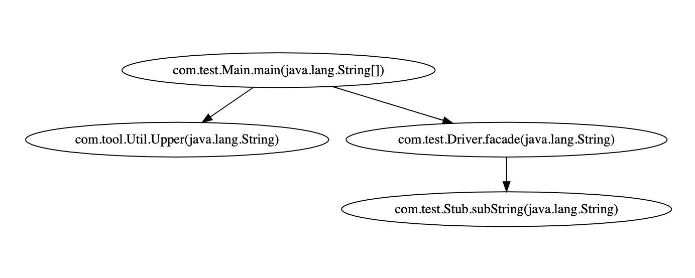

## java-callgraph
A tool to help you generate java call graph.

### usage
```
usage: java -jar java-callgraph-1.0-SNAPSHOT-jar-with-dependencies.jar
       -s <arg> [-l <arg>] [-k <arg>] [-o <arg>] [-h]

========================================
========= java-callgraph 1.0 ===========
========================================
 -s,--src <arg>      source code dirs [required]
 -l,--lib <arg>      library dirs
 -k,--skip <arg>     skip patterns
 -o,--output <arg>   doT file output path
 -h,--help           show help info
========================================
```

### run
```
#set single source code folder
java -jar java-callgraph-1.0-SNAPSHOT-jar-with-dependencies.jar -s "fake/src/main/java"

#set mutiple source code folder
java -jar java-callgraph-1.0-SNAPSHOT-jar-with-dependencies.jar -s "fake1/src/main/java" -s "fake2/src/main/java"

#set library folder
java -jar java-callgraph-1.0-SNAPSHOT-jar-with-dependencies.jar -s "fake/src/main/java" [-l YOUR-MAVEN-LIBRARY -l YOU-JDK-LIBRARY]
```

### call graph
- View doT graph below via https://edotor.net/
```
strict digraph G {
  com_test_StubImpl_subString_java_lang_String_ [ label="com.test.StubImpl.subString(java.lang.String)" ];
  com_test_Texter_getSuffix__ [ label="com.test.Texter.getSuffix()" ];
  com_tool_Util_Upper_java_lang_String_ [ label="com.tool.Util.Upper(java.lang.String)" ];
  com_test_Stub_subString_java_lang_String_ [ label="com.test.Stub.subString(java.lang.String)" ];
  com_test_Main_main_java_lang_String___ [ label="com.test.Main.main(java.lang.String[])" ];
  com_test_Driver_facade_java_lang_String_ [ label="com.test.Driver.facade(java.lang.String)" ];
  com_test_StubImpl_subString_java_lang_String_ -> com_test_Texter_getSuffix__;
  com_test_Main_main_java_lang_String___ -> com_test_Driver_facade_java_lang_String_;
  com_test_Main_main_java_lang_String___ -> com_tool_Util_Upper_java_lang_String_;
  com_test_Driver_facade_java_lang_String_ -> com_test_Stub_subString_java_lang_String_;
}
```

### screenshot

